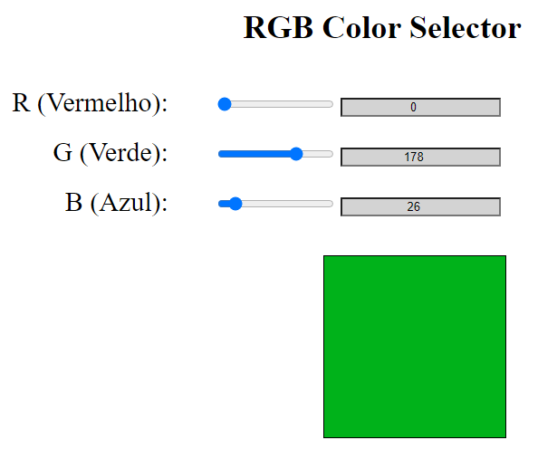

# BootcampIGTI-M1T-RGB-Selector

First practice project of the IGTI Fullstack Developer Bootcamp. 

It's and RGB selector with 3 sliders, one for Red, one for Green and one for Blue values. 

By inputting values it shows the respective RGB color in the square. 

